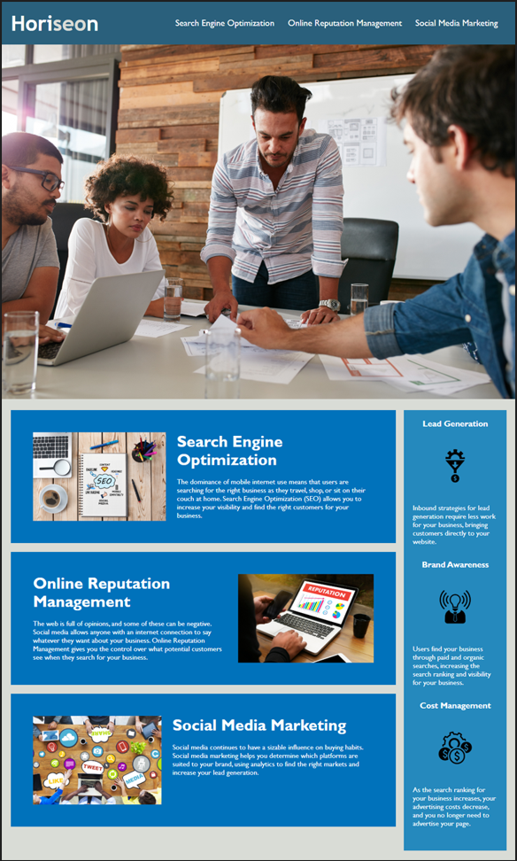

# Module-1-Challenge

## Desctiption
 Given the existing code for Horiseon website, I was given the
task of refactoring it or improving the code. I added a semantic structure to the HTML with a Header, section, main, article within main,
aside, and a footer. This will make the website more accessible along with the additions of alt views for images. I Consolidated the CSS code selectors and organized them to follow the semantic structure of the HTML
elements.

## Assets

The following image demonstrates the web application's appearance and functionality:

## The URL of the deployed application:

https://jerrickjohnson.github.io/Module-1-Challenge/

## The URL of the GitHub repository:

https://github.com/JerrickJohnson/Module-1-Challenge.git